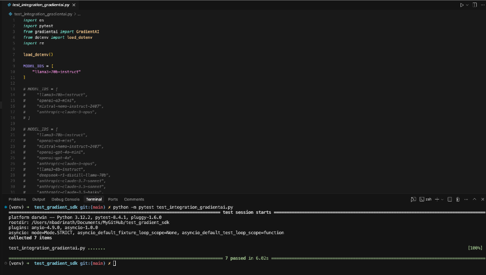
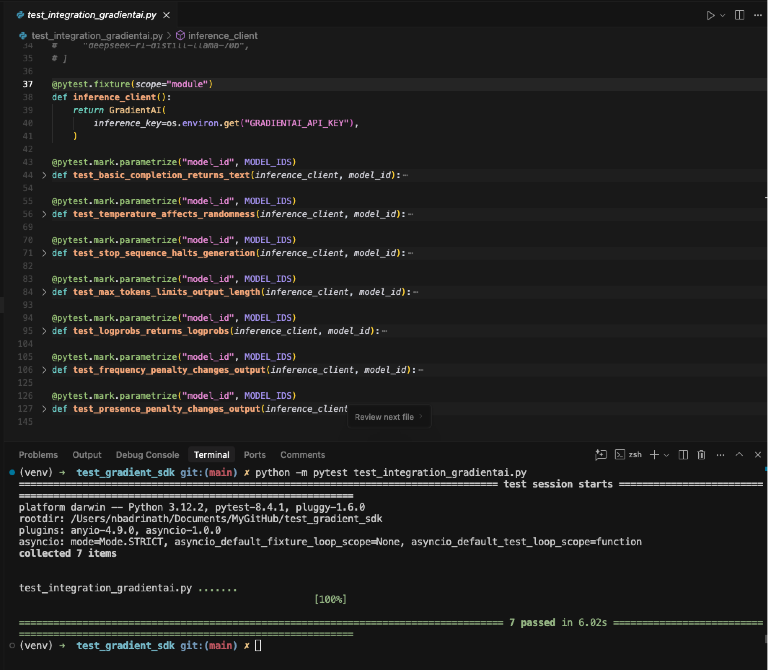
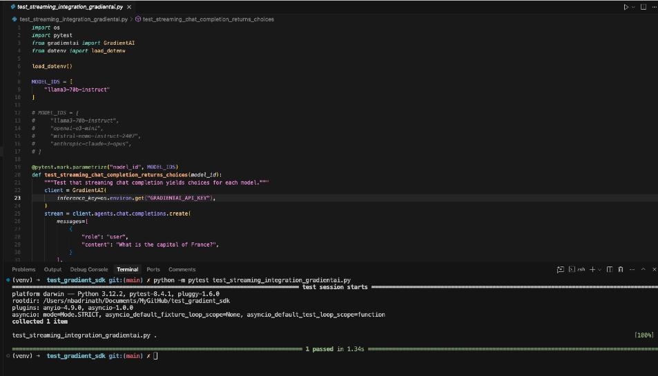
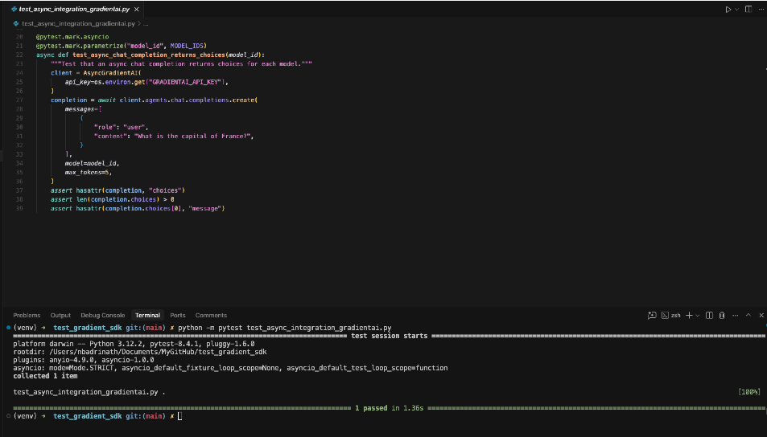
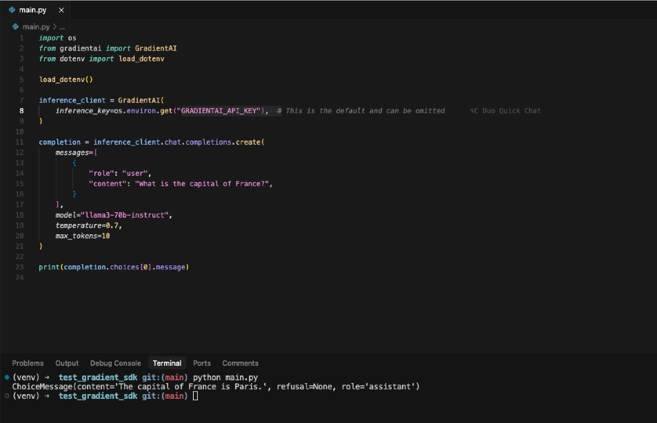

# GradientAI SDK Tests

This repository contains integration tests for the GradientAI SDK, covering synchronous, asynchronous, and streaming chat completion features across multiple models.

## Features
- **Sync API tests**: Test various model parameters and behaviors.
- **Async API tests**: Ensure async client works as expected.
- **Streaming API tests**: Validate streaming completions for supported models.
- **Multi-model coverage**: Tests run across a variety of supported models.

## Results

### Model Parameters Test




### Streaming Test


### Async Test


### Main Example


## Setup

### 1. Clone the repository
```bash
# Example:
git clone <your-repo-url>
cd <repo-directory>
```

### 2. Install dependencies
```bash
pip install -r requirements.txt
# Or, manually:
pip install gradientai pytest pytest-asyncio python-dotenv
```

### 3. Set up environment variables
Create a `.env` file in the project root with your GradientAI keys:
```
GRADIENTAI_INFERENCE_KEY=your-inference-key-here
GRADIENTAI_API_KEY=your-api-key-here
```

## Running the Tests

### Synchronous Integration Tests
```bash
pytest test_integration_gradientai.py
```

### Asynchronous Integration Tests
```bash
pytest test_async_integration_gradientai.py
```

### Streaming Integration Tests
```bash
pytest test_streaming_integration_gradientai.py
```

## Notes
- **Model Support**: Not all models may support all features (e.g., stop sequences, penalties, streaming). Some tests allow for small variances or print values for manual inspection.
- **API Keys**: Make sure your API keys have access to the models you want to test.
- **Test Output**: Some tests print values for manual review, especially for penalty and presence parameters.
- **Dependencies**: The tests require `gradientai`, `pytest`, `pytest-asyncio`, and `python-dotenv`.